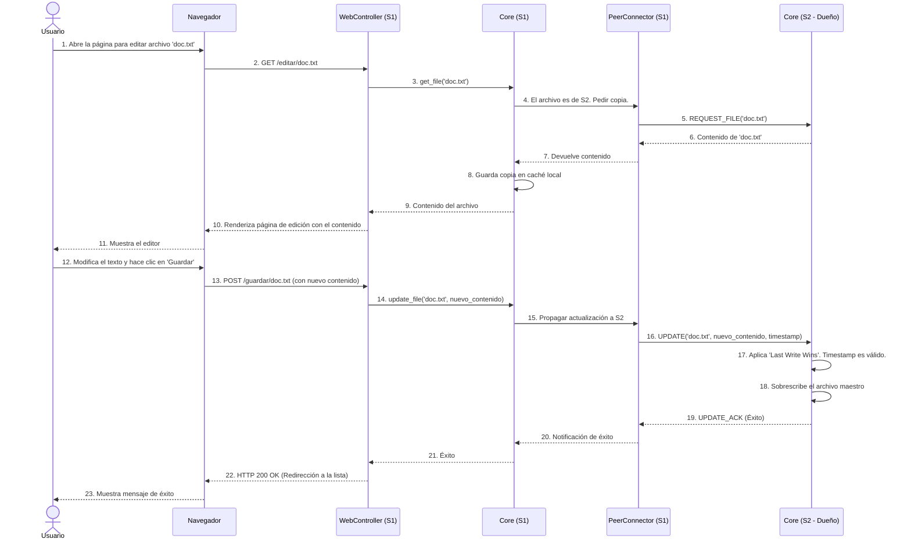

```mermaid
sequenceDiagram
    actor Usuario
    participant Navegador
    participant WebController (S1)
    participant Core (S1)
    participant PeerConnector (S1)
    participant Core (S2 - Dueño)

    Usuario ->> Navegador: 1. Abre la página para editar archivo 'doc.txt'
    Navegador ->> WebController (S1): 2. GET /editar/doc.txt
    WebController (S1) ->> Core (S1): 3. get_file('doc.txt')
    Core (S1) ->> PeerConnector (S1): 4. El archivo es de S2. Pedir copia.
    PeerConnector (S1) ->> Core (S2 - Dueño): 5. REQUEST_FILE('doc.txt')
    Core (S2 - Dueño) -->> PeerConnector (S1): 6. Contenido de 'doc.txt'
    PeerConnector (S1) -->> Core (S1): 7. Devuelve contenido
    Core (S1) ->> Core (S1): 8. Guarda copia en caché local
    Core (S1) -->> WebController (S1): 9. Contenido del archivo
    WebController (S1) -->> Navegador: 10. Renderiza página de edición con el contenido
    Navegador -->> Usuario: 11. Muestra el editor
    
    Usuario ->> Navegador: 12. Modifica el texto y hace clic en 'Guardar'
    Navegador ->> WebController (S1): 13. POST /guardar/doc.txt (con nuevo contenido)
    WebController (S1) ->> Core (S1): 14. update_file('doc.txt', nuevo_contenido)
    Core (S1) ->> PeerConnector (S1): 15. Propagar actualización a S2
    PeerConnector (S1) ->> Core (S2 - Dueño): 16. UPDATE('doc.txt', nuevo_contenido, timestamp)
    
    Core (S2 - Dueño) ->> Core (S2 - Dueño): 17. Aplica 'Last Write Wins'. Timestamp es válido.
    Core (S2 - Dueño) ->> Core (S2 - Dueño): 18. Sobrescribe el archivo maestro
    
    Core (S2 - Dueño) -->> PeerConnector (S1): 19. UPDATE_ACK (Éxito)
    PeerConnector (S1) -->> Core (S1): 20. Notificación de éxito
    Core (S1) -->> WebController (S1): 21. Éxito
    WebController (S1) -->> Navegador: 22. HTTP 200 OK (Redirección a la lista)
    Navegador -->> Usuario: 23. Muestra mensaje de éxito
```
